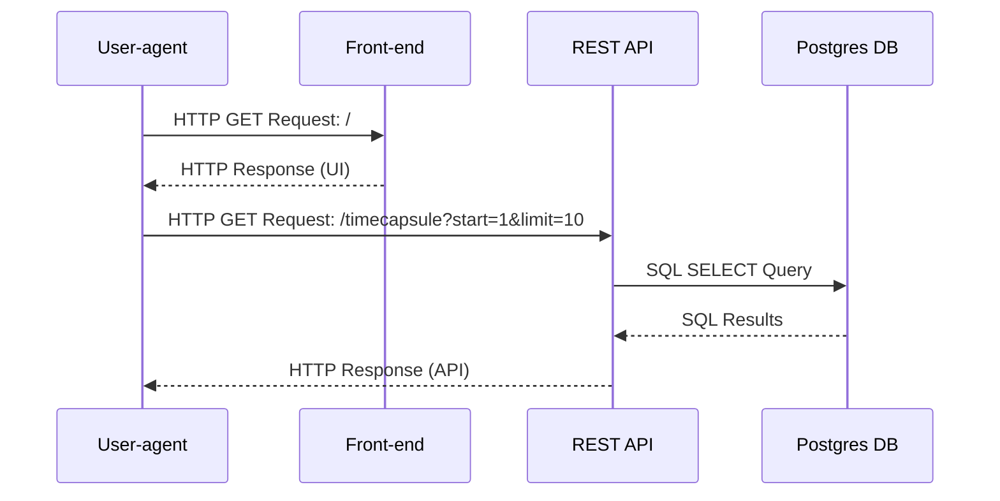
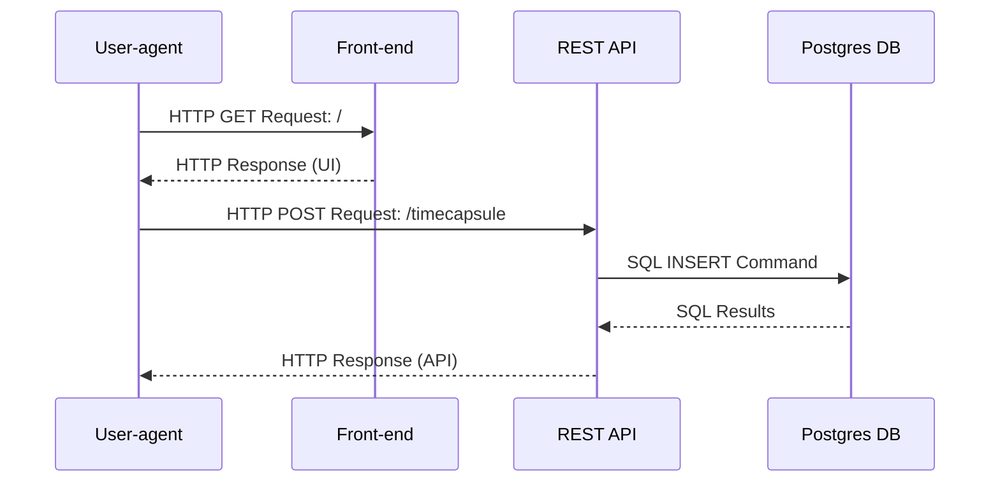

## Presentation

### Sequence Diagram: User-agent GETs Timecapsules

### Sequence Diagram: User-agent POSTs Timecapsule

### UML Class Diagram

- Edit the [Lucidchart here](https://lucid.app/lucidchart/2603a3fc-15f5-4298-adff-3e06fd22bff7/edit?viewport_loc=-846%2C-217%2C3555%2C1837%2C0_0&invitationId=inv_a698e5e1-5cb3-4e22-9ab1-65e1367876ef).
