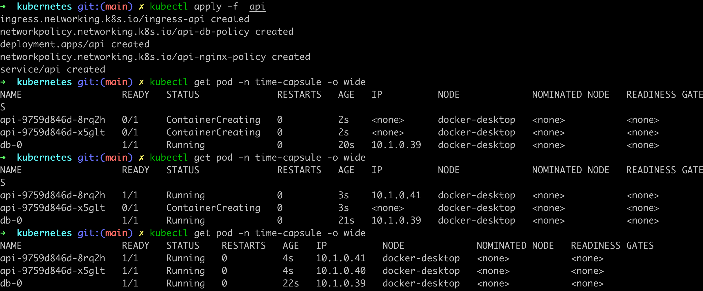
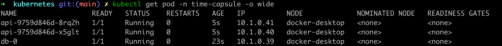
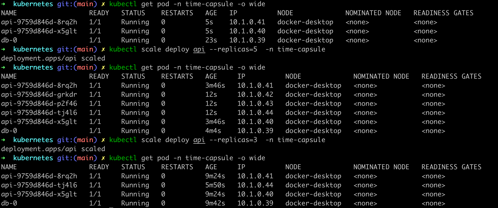
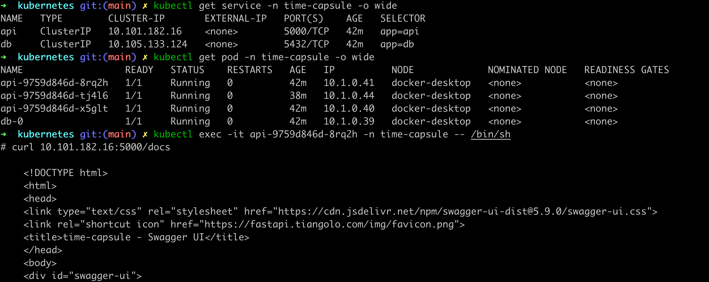
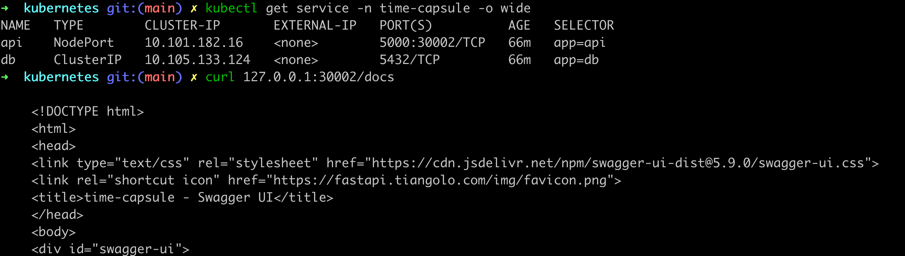

# Webservers

## Assessment

- [x] **API:**
  - [x] **1.1 Create REST API:**
    - Using a technology of your choosing, create a REST API that minimally contains a GET and a POST endpoint. This API should be served by some programming framework or actual application server that can run standalone on the Linux operating system. Popular frameworks are Java JAX-RS (with application servers like Liberty) or Python Flask/FastAPI.
  - [x] **1.2 Containerize the Application:**
    - Containerize the application by creating a Dockerfile and building an image with Docker build.
  - [x] **1.3 Create Kubernetes Deployment:**
    - Create a Kubernetes Deployment that can run one or more replicas of the application. Practice with scaling up and down the number of replicas.
  - [x] **1.4 Create Kubernetes Service/Ingress:**
    - Create a Kubernetes Service/Ingress that exposes the API. Consider the consumption pattern and decide whether you need just a Cluster IP, NodePort, Load Balancer, or Ingress.
  - [x] **1.5 Test API Access:**
    - Test that you can access the API with `curl`, both from inside the cluster and, if needed, from outside the cluster.

- [ ] **Web UI:**
  - [ ] **2.1 Create Web UI:**
    - Using a technology of your choosing, create a Web UI that consumes the API. Common choices include Angular and React. The Web UI should be served by an application server such as nginx or Apache HTTP Server.
  - [ ] **2.2 Containerize Web UI Application:**
    - Containerize the Web UI application + application server by choosing a suitable base image and creating a Dockerfile that installs the application distribution on the application server. For example, if you use Angular+nginx, create a multi-stage Dockerfile (with 2 FROM lines).
  - [ ] **2.3 Create Kubernetes Deployment:**
    - Create a Kubernetes Deployment that initializes one or more replicas of the Web UI.
  - [ ] **2.4 Create Kubernetes Service/Ingress:**
    - Create a Kubernetes Service/Ingress that can be accessed by end users outside of the cluster. Consider the consumption pattern and decide whether you need just a Cluster IP, NodePort, Load Balancer, or Ingress.
  - [ ] **2.5 Test Web UI Access:**
    - Test that you can access the Web UI using a web browser on a machine outside of the cluster.

## Information

In this section, we describe the decisions we have made and why. Note that the [Diagrams](Diagram.md) section contains additional (visual) information on the workings of the frontend, API and DB.

### 🚧 API
#### 1.1 Create REST API
We use FastAPI to build our REST API, which consists of two APIs. The first one is GET /timecapsule, which returns all information about the capsule we have created in the following format:
``` python
{
  "code": success.code,
  "message": success.message,
  "data": {
    "opened_capsules": opened_capsules, # includes titles and messages of opened capsules
    "opened_count": total_opened_count, # number of opened capsules
    "closed_capsule": closed_capsule, # closed capsules without titles and messages
    "closed_count": total_closed_count, # number of closed capsules
    "next_flag": flag_next # flag for frontend to determine if there is another page to render
  }
}
```

The second one is POST /timecapsule, which generates a new capsule using user parameters such as title, message, and open date. The API server validates each parameter's validity. For title and message fields, they can be either too short or too long. As for the date field, it cannot be earlier than the current time.


We have implemented other `error_code` and `error_message` to make HTTP status more detail helping frontend to understand what is happening in the backend.
```python
success = Response(1000, "Success")

param_error = Response(2000, "parameter error")
param_title_error = Response(2001, f"the length of title is less than {settings.MIN_TITLE_LEN}")
param_message_error = Response(2002, f"the length of message is less than {settings.MIN_TITLE_LEN}")
param_expire_error = Response(2003, f"the open date is longer than {settings.MAX_EXPIRE_DAY}")
param_date_invalid = Response(2004, f"the open date is smaller than the current date")
server_error = Response(4000, f"server internal error")
```

#### 1.2 Containerize the Application

In our dockefile, it builds a Docker container for a Python 3.9 web application, copies the application code and dependencies, installs them using pip, and runs the app using Uvicorn on port 5000.

We created and uploaded the image on Docker Hub. You can find it at [this link](https://hub.docker.com/r/segerritsen/time-capsule-api).

```dockerfile
FROM python:3.9
WORKDIR /api

COPY ./requirements.txt /api/requirements.txt
COPY ./app /api/app
COPY main.py /api/main.py

RUN pip install --no-cache-dir --upgrade -r /api/requirements.txt

CMD ["uvicorn", "main:app", "--host", "0.0.0.0", "--port", "5000"]
```

### 1.3 Create Kubernetes Deployment
Creating API-related pods in Kubernetes using `apply`:



The default number of replicas is set to 2:



To scale the replicas up or down, use the `scale` command:




### 1.4 Create Kubernetes Service/Ingress
To minimize the use of ports and loadbalancers for each services, we utilize ingress with an nginx proxy to access services instead of using on ClusterIP or LoadBalancer.
```yaml
   matchLabels:
      app: api
  policyTypes:
    - Ingress
    - Egress
  ingress:
    - from:
        - namespaceSelector:
            matchLabels:
              kubernetes.io/metadata.name: ingress-nginx
      ports:
        - protocol: TCP
          port: 5000
```
### 1.5 Test API Access
The default setting is ClusterIP which allows us to  `curl` the API within the cluster:


To test API access from outside, change the type to NodePort and add a nodePort:
```yaml
  type: NodePort
  ports:
   - port: 5000
     nodePort: 30002
     targetPort: 5000
```

### 🚧 Web UI
TODO
