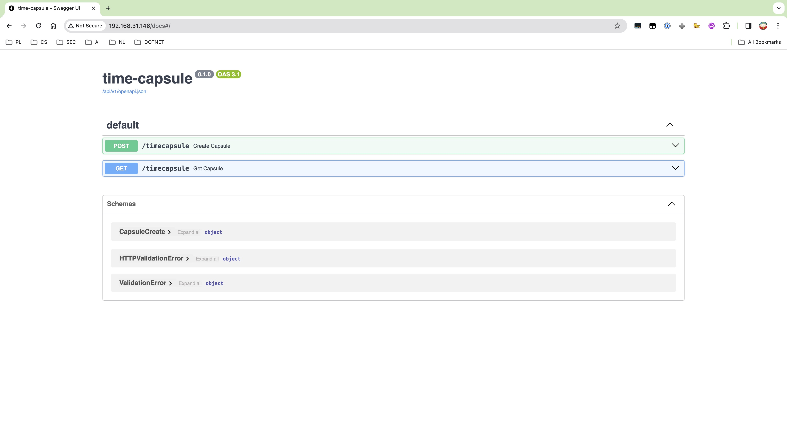

# API 

## TODOs
- [ ] API should not allow new timecapsules to be POSTed with time in the past.
- [ ] Future timecapsule titles should not be displayed.

## Configuration
If we switch from Docker network to some other solution, it is important to change `config.py` accordingly. 

```python
DB_USERNAME: str = "postgres"
DB_PASSWD: str = "s3cr3tp4ssw0rd"
DB_NAME: str = "timecapsule_prod"
DB_HOST: str = "postgres-db-container"
DB_PORT: int = 5432
TABLE_NAME: str = "timecapsules"
```

## Build and run
```bash
docker build -t uvicorn-api-image .
docker run -d --name uvicorn-api-container --network time-capsule-network -p 80:80 uvicorn-api-image 
```

## Documentation

