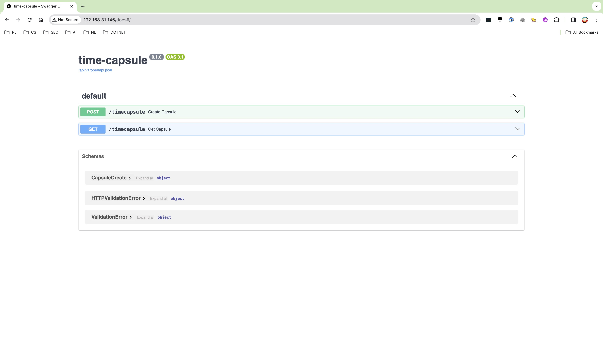

# Time-Capsule Backend

## Installation
### Configuration
edit the app/config.py file, entering the configuration about database
```python
DB_USERNAME: str = "" # USERNAME
DB_PASSWD: str = "" # PASSWORD
DB_NAME: str = "timecapsule_prod"
DB_HOST: str = "" # IP Addredd
DB_PORT: int = 0 # Database Port
TABLE_NAME: str = "timecapsules"
```
### Running
```bash
docker build -t capsule_backend_image .
docker run -d --name capsule_backend -p 80:80 capsule_backend_image
```

