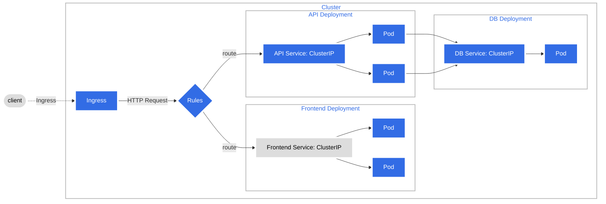
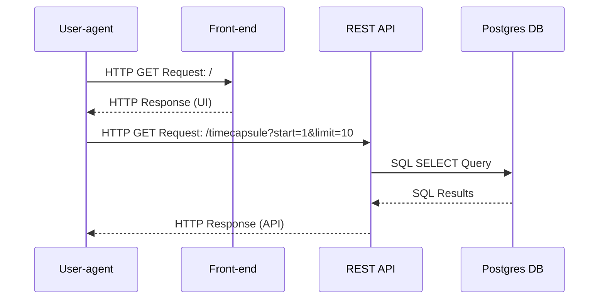
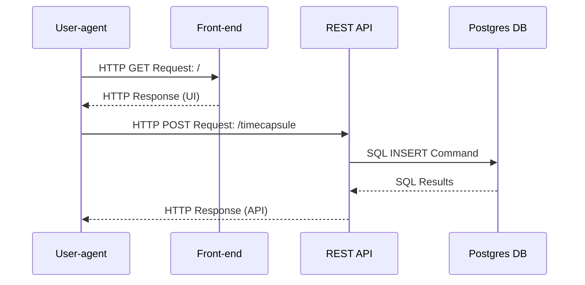

# Presentation materials

- Diagram assessment
    - Asked on 15/01/2024 during class if these diagrams are what is expected or if changes are desired.
    - Professor said that this is good, however, when we are doing the kubernetes deployment that would also need to be included; this includes load balancer/ingress, cluster IP, pod targetports, etc.

## Diagrams

#### Kubernetes Cluster diagram

#### Sequence Diagram: User-agent GETs Timecapsules

#### Sequence Diagram: User-agent POSTs Timecapsule

#### UML Class Diagram

- Edit the [Lucidchart here](https://lucid.app/lucidchart/2603a3fc-15f5-4298-adff-3e06fd22bff7/edit?viewport_loc=-846%2C-217%2C3555%2C1837%2C0_0&invitationId=inv_a698e5e1-5cb3-4e22-9ab1-65e1367876ef).
